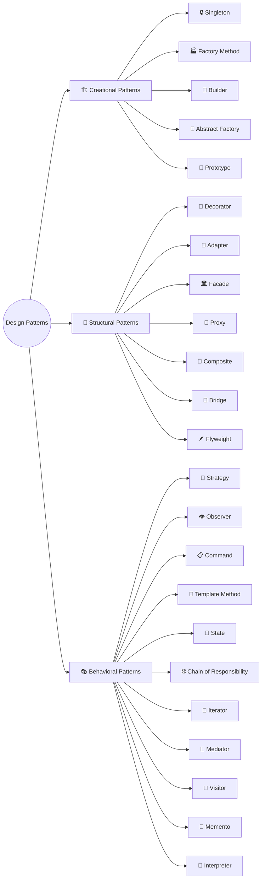

# Design Patterns

Design Patterns in C#

```mermaid
flowchart LR
    root((Design Patterns))
    
    creational[🏗️ Creational Patterns]
    structural[🔧 Structural Patterns]
    behavioral[🎭 Behavioral Patterns]
    
    singleton[🔒 Singleton]
    factory[🏭 Factory Method]
    builder[🧱 Builder]
    abstract-factory[🏢 Abstract Factory]
    prototype[🐑 Prototype]
    
    decorator[🎁 Decorator]
    adapter[🔌 Adapter]
    facade[🏛️ Facade]
    proxy[🚪 Proxy]
    composite[🌳 Composite]
    bridge[🌉 Bridge]
    flyweight[🪶 Flyweight]
    
    strategy[🎯 Strategy]
    observer[👁️ Observer]
    command[📋 Command]
    template[📝 Template Method]
    state[🔄 State]
    chain[⛓️ Chain of Responsibility]
    iterator[🔁 Iterator]
    mediator[🤝 Mediator]
    visitor[🚶 Visitor]
    memento[💾 Memento]
    interpreter[📖 Interpreter]
    
    root --> creational
    root --> structural
    root --> behavioral
    
    creational --> singleton
    creational --> factory
    creational --> builder
    creational --> abstract-factory
    creational --> prototype
    
    structural --> decorator
    structural --> adapter
    structural --> facade
    structural --> proxy
    structural --> composite
    structural --> bridge
    structural --> flyweight
    
    behavioral --> strategy
    behavioral --> observer
    behavioral --> command
    behavioral --> template
    behavioral --> state
    behavioral --> chain
    behavioral --> iterator
    behavioral --> mediator
    behavioral --> visitor
    behavioral --> memento
    behavioral --> interpreter
```
